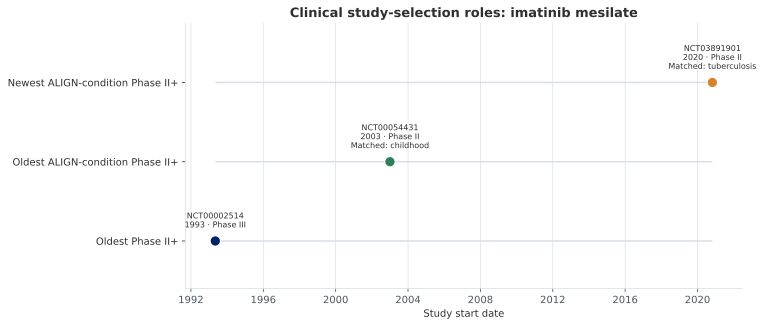

## Why clinical evidence is treated as enrichment

ClinicalTrials.gov does not provide a product registry that can be joined directly to ALIGN. It provides study records whose intervention fields were entered by sponsors and study teams. The same product can appear as an ingredient name, salt, brand, development code, combination, or free-text treatment description. A search based only on the canonical product key may therefore miss relevant studies, while a broad search across every known synonym can retrieve records that are difficult to attribute and reproduce.

ALIGN handles this tension by separating the clinical workflow into three decisions. First, it chooses one specific intervention term that is likely to represent the generic product. Second, it retrieves studies for that term and classifies them using consistent phase, date, and condition rules. Third, it retains a small set of studies that describe different points in the product's clinical history. The selected records enrich the product profile; they do not redefine product identity.

The result is deliberately interpretive rather than exhaustive. It is intended to provide a traceable horizon-scanning view of clinical development while retaining the search term, study identifier, selection role, matched condition, and source provenance needed to revisit the decision.

## Clinical enrichment workflow

```{mermaid}
%%| label: fig-clinical-enrichment-workflow
%%| fig-cap: "Clinical enrichment begins with the accumulated product vocabulary, reduces it to one reproducible intervention query, and selects up to three complementary Phase II-or-later study roles."
flowchart LR
    P["Canonical product profile<br/>canonical name + accumulated synonyms"] --> C["Build candidate term set<br/>deduplicate names"]
    C --> D{"More than two names<br/>and name selection enabled?"}
    D -- "No" --> K["Use canonical name"]
    D -- "Yes" --> L["Select one common,<br/>simple generic term"]
    K --> Q["ClinicalTrials.gov API<br/>intervention query"]
    L --> Q
    Q --> R["Retrieve and parse studies<br/>retain query provenance"]
    R --> F["Eligibility filter<br/>Phase II, III, or IV + start date"]
    F --> T["Classify study conditions<br/>TB · HIV · malaria · MNCH"]
    T --> O["Oldest eligible<br/>Phase II+ study"]
    T --> A["Oldest ALIGN-condition<br/>Phase II+ study"]
    T --> N["Newest ALIGN-condition<br/>Phase II+ study"]
    O --> U["Deduplicate NCT IDs<br/>combine selection reasons"]
    A --> U
    N --> U
    U --> M["Attach selected full study objects<br/>to canonical product"]
    M --> X["Publish study, term, result,<br/>and product-link tables"]
```

The workflow stores both `canonical_name` and `search_name_used`. This distinction is essential. The canonical name explains which ALIGN product initiated the search; the selected term explains what was actually sent to ClinicalTrials.gov. A result can therefore be reproduced without assuming that the canonical key and the external search expression were identical.

## Step 1: choose one generic intervention term

The workflow begins with the product vocabulary accumulated before clinical enrichment. The candidate set contains the canonical key and all structured synonym values attached to the master record. Duplicate values are removed before any choice is made.

If the product has only one or two unique names, the pipeline uses the canonical name. If more than two names are available and language-model selection is enabled, the model is asked to choose the single simplest and most common intervention name from the supplied options. The prompt favors a generic ingredient-level expression. It does not ask the model to invent a new drug name or decide whether two products are equivalent.

This is a search-term selection task, not a new identity-resolution stage. Product identity has already been established in the canonical registry. The selected term only controls recall in the external study search, and it is written to `selected_names.jsonl` alongside the canonical name.

For a record such as `imatinib mesilate`, the accumulated vocabulary can include `imatinib mesylate` and the ingredient-level term `imatinib`. The generic term is useful because study interventions may use the ingredient name even when the canonical record is represented by a salt form. The original canonical key remains the product-level join key throughout the workflow.

Implementation: [`llm_select_best_intervention_name()`](https://github.com/souzajvp/ALIGN-drug-pipeline/blob/main/scripts/clinicaltrials_gov/clinical_trials_pipeline_step1.py#L20) and the [step-one orchestration](https://github.com/souzajvp/ALIGN-drug-pipeline/blob/main/scripts/clinicaltrials_gov/clinical_trials_pipeline_step1.py#L54).

## Step 2: retrieve and structure the study universe

The selected name is submitted to the ClinicalTrials.gov API as an intervention query. ALIGN uses [`CTGovV2Client.search_by_intervention()`](https://github.com/souzajvp/ALIGN-drug-pipeline/blob/main/scripts/clinicaltrials_gov/ctgov_api.py#L98), with a configurable maximum number of studies per product. The current command-line default is 100. Raw study responses are saved before filtering, together with the canonical name, search term, and extraction timestamp.

Saving the retrieved universe serves two purposes. It prevents the selected study set from becoming an unexplained endpoint, and it allows the filtering rules to be rerun without immediately repeating every API request. Study records are then parsed into a consistent structure containing study-level metadata and nested conditions, interventions, arms, outcomes, eligibility, and results where available.

The source for this stage is the [ClinicalTrials.gov API](https://clinicaltrials.gov/data-api/api). Individual selected records retain a direct API provenance URL based on their NCT identifier.

## Step 3: identify studies eligible for selection

The pipeline does not rank every retrieved study. It first defines the eligible set:

1. The study must be Phase II, Phase III, or Phase IV. Early Phase I and Phase I studies are excluded from the selection roles.

2. The study must have a usable start date. Dates are required because each role is defined by temporal ordering.

3. The study conditions are evaluated against ALIGN's condition families: tuberculosis, HIV, malaria, and maternal, newborn, and child health (MNCH).

Condition classification uses explicit vocabulary rules. Tuberculosis matching includes terms such as `tuberculosis`, `MDR-TB`, and `XDR-TB`; HIV and malaria use their own term sets; MNCH includes terms associated with pregnancy, neonatal care, infancy, pediatrics, and childhood. The matched terms are written into the selected study output rather than remaining hidden inside the filter.

This approach makes the definition of an “ALIGN-condition study” inspectable. It also means the result should be interpreted as a vocabulary-based classification, not as a clinical judgment that the study's primary purpose was product repurposing. Broad terms such as `childhood` can qualify a study for the MNCH family even when the underlying disease is oncology. Such cases are visible in the matched-condition field and can inform later refinement of the vocabulary.

Implementation: [`is_phase_2_or_greater()`](https://github.com/souzajvp/ALIGN-drug-pipeline/blob/main/scripts/clinicaltrials_gov/clinical_trials_pipeline_step2.py#L30), [`matches_condition()`](https://github.com/souzajvp/ALIGN-drug-pipeline/blob/main/scripts/clinicaltrials_gov/clinical_trials_pipeline_step2.py#L36), and [`filter_studies_for_product()`](https://github.com/souzajvp/ALIGN-drug-pipeline/blob/main/scripts/clinicaltrials_gov/clinical_trials_pipeline_step2.py#L101).

## Step 4: preserve three views of clinical history

From the eligible universe, ALIGN selects up to three roles:

1. **Oldest Phase II-or-later study.** This is the earliest dated study at Phase II, III, or IV, regardless of disease area. It provides a historical anchor for the product's more mature clinical development.

2. **Oldest ALIGN-condition Phase II-or-later study.** This is the earliest eligible study whose conditions match TB, HIV, malaria, or MNCH terminology. It marks the earliest selected connection to an ALIGN condition.

3. **Newest ALIGN-condition Phase II-or-later study.** This is the most recent eligible study in an ALIGN condition. It provides a current horizon-scanning signal and can reveal later repurposing or renewed development activity.

These roles are not three independent searches. They are three selections from the same retrieved and classified study universe. The same NCT record can satisfy more than one role. When the oldest and newest condition-of-interest study are identical, the pipeline does not duplicate the study; it combines the applicable selection reasons.

The integration stage repeats the selection contract when full study objects are attached to the master record. This protects the final product profile from partial or inconsistent intermediate outputs. See [`select_studies_for_product()`](https://github.com/souzajvp/ALIGN-drug-pipeline/blob/main/scripts/integrate_clinical_trials.py#L36).

## Worked example: imatinib and tuberculosis repurposing

Imatinib is a useful example because the current ALIGN data connects a well-known oncology product to later tuberculosis research. The canonical key used for the three-role illustration is `imatinib mesilate`; the product vocabulary also contains `imatinib mesylate` and `imatinib`. The Innovation Guide Horizon data identifies imatinib as a Phase II tuberculosis candidate, and the clinical enrichment output selects [NCT03891901](https://clinicaltrials.gov/study/NCT03891901) as the newest ALIGN-condition Phase II-or-later study.

{#fig-imatinib-study-selection fig-alt="A three-lane timeline for imatinib mesilate marks a 1993 Phase III leukemia study as the oldest Phase II-or-later study, a 2003 Phase II study matched through the term childhood as the oldest ALIGN-condition study, and a 2020 Phase II tuberculosis study as the newest ALIGN-condition study." width="100%"}

| Selection role | Selected record | Why it is retained |
|---|---|---|
| Oldest Phase II+ | [NCT00002514](https://clinicaltrials.gov/study/NCT00002514), Phase III, started 1993 | Earliest dated Phase II-or-later record in the retrieved imatinib study universe |
| Oldest ALIGN-condition Phase II+ | [NCT00054431](https://clinicaltrials.gov/study/NCT00054431), Phase II, started 2003 | Earliest eligible record classified into an ALIGN condition; the recorded matched term is `childhood` |
| Newest ALIGN-condition Phase II+ | [NCT03891901](https://clinicaltrials.gov/study/NCT03891901), Phase II, started 2020 | Most recent eligible record with the matched condition `tuberculosis`; the interventions include imatinib, isoniazid, and rifabutin |

The example shows why all three roles matter. The first establishes the historical clinical-development horizon. The second exposes the earliest result of the condition vocabulary, including a potentially broad MNCH classification that should remain auditable. The third captures the later tuberculosis signal that makes imatinib relevant to repurposing and horizon scanning.

It also demonstrates why the query term must remain visible. A salt-form canonical key can lead to a generic intervention search, which can retrieve both the product's established oncology history and newer studies in a different therapeutic context. The clinical records are connected by the canonical product but retain their own conditions, interventions, phases, dates, and selection reasons.

## What enters the canonical product profile

The selected studies are stored under the product's `clinical_trials.gov` collection in the version-five master record. Each selected object retains its NCT ID, study metadata, nested study content, matched-condition fields, selection role, extraction date, and ClinicalTrials.gov provenance. The clinical integration does not add every retrieved study to the canonical record.

During relational publication, the nested objects are separated into study-level and child tables. The main analytical objects include:

- `clinical_trial_product_links`, which connects the canonical product to the NCT ID and selection role;
- `clinical_trials`, which holds one study-level representation per NCT ID;
- `clinical_trial_terms`, which normalizes conditions, interventions, keywords, and other search-relevant terms;
- `clinical_trial_results`, which contains flattened results observations; and
- clinical QA and summary views used to identify incomplete or inconsistent study structures.

This publication model permits product-level horizon scanning without losing the study grain. Analysts can begin with a canonical product, inspect why a study was selected, and then move into its terms, outcomes, arms, or results.

## Interpretation and review

The three-study view is a purposeful summary, not a systematic review and not a complete clinical evidence synthesis. It does not rank study quality, infer efficacy, or establish that a product is appropriate for a new indication. Its function is to preserve three reproducible temporal signals from a defined retrieved universe.

Review should focus on four questions:

- Was the selected generic search term broad enough to recover the relevant intervention records without becoming ambiguous?
- Did the intervention query retrieve studies that actually contain the product or a defensible name variant?
- Did the condition vocabulary classify the study for the intended reason?
- If one study satisfies multiple roles, were the selection reasons combined rather than duplicated?

These checks keep the workflow useful for horizon scanning while making its assumptions visible to domain experts.

## Continue through the documentation

- [Pipeline overview](../pipeline/index.qmd) explains how clinical enrichment fits into the cumulative product registry.
- [Detailed pipeline process](../pipeline/process.qmd#attach-selected-clinicaltrials.gov-evidence) summarizes the clinical stage within the full version lineage.
- [Master-record schema](../data-model/master-record-schema.qmd) describes the nested product contract.
- [Relational data model](../data-model/index.qmd) describes the published analytical layer.
