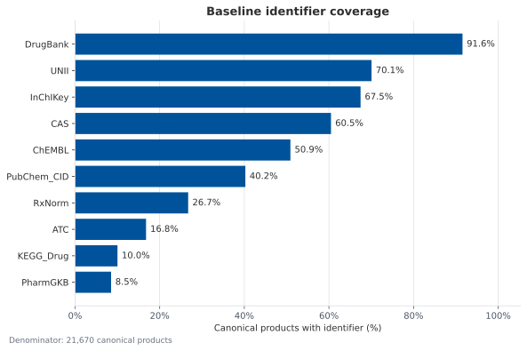
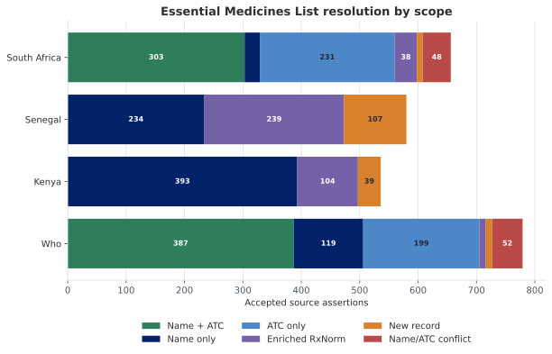
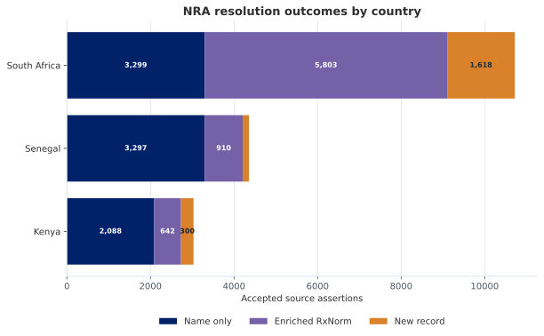
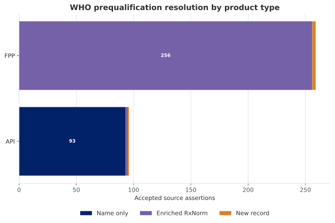
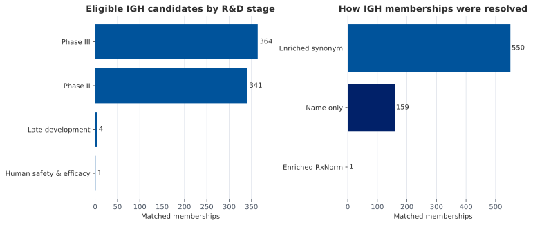
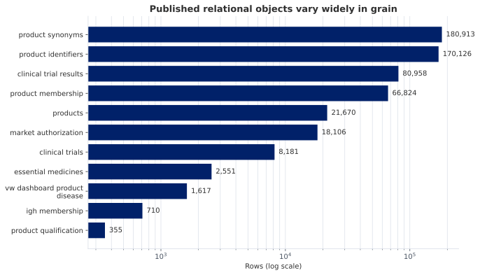

## Why the pipeline needs more than one diagram

No single figure can explain the entire pipeline well. Readers need three complementary kinds of visual:

1. **Conceptual figures** explain what a canonical product is and why source assertions remain separate from identity.
2. **Process figures** show the sequence of transformations and decision gates.
3. **Quality-assurance figures** show what actually happened during a run: how many rows matched, which evidence resolved them, and where uncertainty remains.

The first two can be maintained as stable diagrams in the documentation. QA figures should be generated from the current pipeline outputs so that counts and distributions change with the data rather than becoming stale illustrations.

## Generated evaluation set

The figures below are working candidates, not yet final publication graphics. They deliberately mix stable explanatory diagrams with charts generated from the current relational export. This makes it possible to evaluate two questions separately: whether a figure explains the pipeline logic, and whether the same figure is useful for monitoring a real run.

### Canonical product and source assertions

The canonical product is the identity hub. Source records remain evidence-bearing assertions linked to that hub; they are not flattened into a single undifferentiated record. This figure is intended for readers who need to understand the data model before they encounter matching details.

```{mermaid}
%%| fig-cap: "One canonical product can accumulate multiple kinds of source evidence without losing the identity, scope, or provenance of the source assertions."
%%| label: fig-canonical-hub
flowchart LR
    EML["Essential-medicine listing<br/>scope · source name · ATC"] --> P["Canonical product<br/>canonical_key · resolution"]
    NRA["Market authorization<br/>country · authorization ID · presentation"] --> P
    PQ["WHO prequalification<br/>API/FPP · reference · status"] --> P
    CT["Clinical study link<br/>NCT ID · role · intervention"] --> P
    IGH["Innovation-horizon record<br/>stage · indication · developer"] --> P
    FDA["FDA product/application<br/>application · product · confidence"] --> P
    P --> ID["Identifiers<br/>DrugBank · RxNorm · ATC · UNII"]
    P --> SYN["Synonyms<br/>name variants · provenance"]
```

### General entity-resolution logic

This decision tree abstracts the repeated logic used by the source-integration stages. Individual scripts use different evidence fields, but the governing distinction is stable: direct evidence is tried first, enrichment is used only when needed, and product creation is allowed only where the stage's policy explicitly permits it.

```{mermaid}
%%| fig-cap: "Shared entity-resolution pattern across EML, NRA, WHO PQ, and IGH integrations."
%%| label: fig-resolution-tree
flowchart TD
    A["Normalize source name and identifiers"] --> B{"Direct evidence resolves<br/>one canonical product?"}
    B -- "Yes" --> C["Attach source assertion<br/>match_phase = 1"]
    B -- "No" --> D["Enrich unresolved row<br/>synonym · RxNorm · ATC"]
    D --> E{"Enriched evidence resolves<br/>one canonical product?"}
    E -- "Yes" --> F["Attach source assertion<br/>match_phase = 2"]
    E -- "No" --> G{"Does this stage allow<br/>canonical promotion?"}
    G -- "Yes, and anchor criteria pass" --> H["Create canonical product<br/>and retain provenance"]
    G -- "No, or criteria fail" --> I["Retain as unmatched/review<br/>do not alter identity hub"]
    C --> J["Publish method and evidence"]
    F --> J
    H --> J
```

### Baseline identifier coverage

This chart tests whether the baseline provides enough identifier evidence for later resolution strategies. DrugBank accessions are nearly universal, while RxNorm and ATC cover much smaller subsets; this helps explain why later stages cannot rely on a single identifier family.

{#fig-baseline-identifier-coverage fig-alt="Horizontal bars show the percentage of baseline canonical products carrying selected identifiers, led by DrugBank and followed by UNII, InChIKey, CAS, ChEMBL, PubChem CID, RxNorm, ATC, KEGG Drug, and PharmGKB." width="100%"}

### EML resolution by scope

The EML chart is designed to expose source-specific behavior. WHO and South Africa benefit strongly from name-plus-ATC and ATC-only evidence, whereas Kenya and Senegal rely more heavily on name and enrichment paths. Conflict segments remain visible rather than being absorbed into successful matches.

{#fig-eml-resolution fig-alt="Stacked horizontal bars compare EML resolution methods for WHO, Kenya, Senegal, and South Africa." width="100%"}

### NRA resolution by country

This chart separates regulatory-source volume from resolution behavior. South Africa contributes the largest number of authorization assertions and depends heavily on enriched RxNorm evidence, while Kenya and Senegal are more commonly resolved by direct name.

{#fig-nra-resolution fig-alt="Stacked horizontal bars show name-only, enriched-RxNorm, and new-record outcomes for NRA assertions by country." width="100%"}

### WHO prequalification resolution by product type

API and finished pharmaceutical product records do not behave as one homogeneous source. The current export shows FPP records resolving almost entirely through enriched RxNorm evidence, while API records resolve primarily by name.

{#fig-who-pq-resolution fig-alt="Two stacked bars compare WHO PQ resolution for API and FPP records by name-only, enriched-RxNorm, and new-record methods." width="100%"}

### Clinical study-selection example

The timeline makes the three study roles concrete. For imatinib mesilate, the oldest eligible Phase II-or-later study, the oldest study classified into an ALIGN condition, and the newest ALIGN-condition study are different records. The newest role captures a Phase II tuberculosis study, illustrating the repurposing signal that the clinical workflow is designed to surface. The visual also makes the broad `childhood` condition match visible for review.

{#fig-clinical-selection fig-alt="A three-lane timeline marks selected imatinib mesilate studies in 1993, 2003, and 2020 for the oldest Phase II plus, oldest ALIGN-condition Phase II plus, and newest ALIGN-condition Phase II plus roles; the newest study is matched to tuberculosis." width="100%"}

### IGH eligibility and resolution profile

The paired chart distinguishes two different questions: which eligible development stages reach integration, and which evidence actually resolves those records to canonical products. It also makes the dominant role of enriched synonyms easy to audit.

{#fig-igh-stage-resolution fig-alt="Two horizontal bar charts show IGH memberships by development stage and by enriched-synonym, name-only, or enriched-RxNorm resolution." width="100%"}

### FDA confidence gate

FDA search results are candidates, not automatic evidence. This figure shows the conservative acceptance rule: exact approved-field matches enter the canonical product's FDA enrichment, while contains matches, ambiguous candidates, and nonmatches remain reviewable without silently changing the record.

```{mermaid}
%%| fig-cap: "Candidate FDA records pass through an explicit confidence gate before becoming accepted enrichment."
%%| label: fig-fda-confidence
flowchart LR
    A["Canonical name and approved search variants"] --> B["Drugs@FDA candidate records"]
    B --> C["Flatten application and product fields"]
    C --> D{"Exact match on an<br/>approved comparison field?"}
    D -- "Yes" --> E["High confidence<br/>accept FDA enrichment"]
    D -- "No" --> F{"Contains match or<br/>other plausible evidence?"}
    F -- "Yes" --> G["Review confidence<br/>write review candidate"]
    F -- "No" --> H["Unmatched<br/>retain search provenance"]
```

### Relational publication model

The publication model deliberately uses different grains. Product identity sits in `products`; repeating evidence is normalized into child tables; analytical views then combine only the grains needed by downstream consumers.

```{mermaid}
%%| fig-cap: "The canonical product table anchors normalized evidence tables, which are subsequently composed into analytical views."
%%| label: fig-relational-model
flowchart LR
    M["Master v7 JSONL"] --> P["products<br/>one row per canonical product"]
    M --> I["product_identifiers"]
    M --> S["product_synonyms"]
    M --> PM["product_membership"]
    M --> E["essential_medicines"]
    M --> N["market_authorization"]
    M --> Q["product_qualification"]
    M --> G["igh_membership"]
    M --> F["fda_enrichment"]
    M --> C["clinical_trials and child tables"]
    P --> V["Analytical views"]
    I --> V
    S --> V
    PM --> V
    E --> V
    N --> V
    Q --> V
    G --> V
    F --> V
    C --> V
    V --> D["CSV / Supabase / dashboard"]
```

### Relational object sizes

The row-count chart complements the structural diagram. Its logarithmic scale shows why table grain matters: synonyms and identifiers are an order of magnitude larger than the canonical product table, while qualification and innovation memberships are much smaller evidence collections.

{#fig-relational-row-counts fig-alt="Horizontal bars on a log scale compare row counts from product qualification at 355 rows through product synonyms at 180,913 rows." width="100%"}

## Highest-priority cross-pipeline figures

| Priority | Figure | What it should explain | Recommended form |
|---:|---|---|---|
| 1 | End-to-end pipeline and master-version lineage | Which source enters at each stage and which version leaves it | Left-to-right flowchart with source inputs above and `v1`–`v7` outputs on the main spine |
| 2 | Canonical product versus source assertions | Why an authorization, EML listing, WHO PQ record, study, and FDA application can describe one product without becoming five products | Hub-and-spoke entity diagram centered on a canonical product |
| 3 | General entity-resolution decision tree | How phase 1, phase 2, promotion, unmatched, and review outcomes differ | Decision tree with explicit evidence gates |
| 4 | Record accumulation through stages | Which collections are added or expanded at each master version | Layered record schematic or annotated JSON object |
| 5 | Relational publication lineage | How nested master-record collections become tables and dashboard views | Data-lineage diagram from JSONL to DuckDB tables to views and dashboard |

The end-to-end figure is already represented in simplified form on the [Pipeline overview](index.qmd). The next diagram to produce should be the canonical-product hub-and-spoke figure because it explains the most important modeling decision to nontechnical readers.

## Figure 1: baseline initialization

### Documentation figures

- **DrugBank source-consolidation diagram:** show merged drug links, vocabulary CSV, and full XML converging on one canonical record.
- **Canonical record anatomy:** annotate `canonical_key`, `resolution`, `identifiers`, `synonyms`, `membership`, and `enrichment` using one synthetic example.
- **Identifier provenance example:** show the same product receiving DrugBank, CAS, ATC, UNII, RxNorm, and PubChem identifiers from different DrugBank files.

### QA figures

- **Identifier coverage bar chart:** percentage of baseline products with each identifier type.
- **DrugBank category distribution:** product counts by `drugbank_type`, preferably distinguishing overlapping category membership from mutually exclusive counts.
- **Synonym-depth distribution:** histogram of synonyms per canonical product.
- **Canonical-key collision table or chart:** number of DrugBank accessions sharing a normalized key.

### Best first figure

Use a three-input convergence diagram. It should make clear that the pipeline is consolidating complementary DrugBank exports, not treating them as three independent product sources.

## Figure 2: Essential Medicines List integration

### Documentation figures

- **EML matching decision tree:** normalized name → ATC evidence → agreement/conflict → enrichment → RxNorm/ATC/name retry → new record or unmatched.
- **Provenance example:** one source row with original EML name and ATC code linked to a canonical product, with `match_phase`, `match_method`, `value_eml`, and `value_master` labeled.
- **List-membership model:** one canonical product connected to WHO, Kenya, Senegal, and South Africa memberships.

### QA figures

- **Match funnel:** total EML rows → phase-1 matches → phase-2 matches → new records → unmatched.
- **Match-method composition:** stacked bars by EML scope for `name+atc`, `name_only`, `atc_only`, conflict, and enriched methods.
- **EML overlap view:** UpSet plot showing membership combinations across global and national lists.
- **Conflict review chart:** count and proportion of `name+atc_conflict` rows by scope.
- **New-record evidence chart:** identifiers available for products promoted from EML inputs.

### Best first figure

Use a Sankey or funnel broken down by scope. It will show both pipeline performance and whether one national list depends disproportionately on enrichment.

## Figure 3: NRA capture, harmonization, and integration

### Documentation figures

- **Country-source harmonization diagram:** Kenya, Senegal, and South Africa source schemas flowing into the shared NRA contract.
- **Presentation versus canonical identity example:** several brand/strength/pack authorization rows converging on one ingredient-level product while retaining separate authorization IDs.
- **NRA resolution decision tree:** generic name preference → product-name fallback → exact match → enrichment → clinical-anchor gate → new record or unmatched.

### QA figures

- **Country-level match funnel:** source rows, harmonized rows, phase-1 matches, phase-2 matches, promoted records, and unmatched records by country.
- **Match-method distribution by country:** percentage resolved by direct name, enriched name, ATC, and RxNorm.
- **Presentation multiplicity distribution:** authorizations per canonical product, highlighting unusually large clusters.
- **Authorization status and expiry view:** counts by country and current status, with missing or expired dates visible.
- **Potential duplication audit:** canonical products sharing RxCUI, ATC, or normalized ingredient names.
- **Missing-field heatmap:** completeness of generic name, authorization ID, status, manufacturer, dates, strength, and dosage form by country.

### Best first figure

Use a two-level figure: a country harmonization flow on the left and a resolution funnel on the right. This communicates that schema harmonization and entity resolution are different operations.

## Figure 4: WHO prequalification integration

### Documentation figures

- **API versus FPP normalization diagram:** show how the two input shapes map into shared qualification fields.
- **WHO PQ resolution tree:** exact name → enrichment cache/LLM → name, ATC, or RxNorm match → clinical-anchor promotion or unmatched.
- **Qualification-versus-authorization model:** visually distinguish WHO PQ membership from NRA authorization.

### QA figures

- **Match funnel by PQ type:** separate API and FPP totals across phase 1, phase 2, new records, and unmatched.
- **Match-method distribution:** direct name versus enriched name, ATC, and RxNorm.
- **Qualification timeline:** prequalification counts by year and PQ type.
- **Therapeutic-area coverage:** product counts and unmatched rates by therapeutic area.
- **Cache contribution chart:** how many phase-2 rows reused cached enrichment versus required new enrichment.

### Best first figure

Use paired funnels for API and FPP. Their different granularity is likely to produce different match behavior, and a combined total would hide that distinction.

## Figure 5: ClinicalTrials.gov evidence selection

### Documentation figures

- **Three-step clinical workflow:** canonical product and synonyms → selected search term → ClinicalTrials.gov results → selected study roles → master record.
- **Study-selection timeline:** plot all eligible studies for one synthetic product and label the oldest Phase II+, oldest condition-of-interest Phase II+, and newest condition-of-interest Phase II+ selections.
- **Nested clinical data map:** study → conditions/interventions → arms → outcomes/results → relational clinical tables.

### QA figures

- **Clinical retrieval funnel:** products queried → products with any studies → products with Phase II+ studies → products with an ALIGN condition → products receiving selected studies.
- **Search-term audit:** proportion using canonical name versus LLM-selected synonym, with retrieval yield for each group.
- **Selection-reason distribution:** counts for the three selection roles and their overlaps.
- **Disease-area coverage:** selected studies across TB, HIV, malaria, and MNCH.
- **Phase and status distributions:** selected studies by phase and overall status.
- **Timeline coverage:** distribution of oldest and newest selected study dates.

### Best first figure

Use the annotated study-selection timeline. The “up to three studies” rule is difficult to understand from prose but becomes immediate when shown along a time axis.

## Figure 6: Innovation Guide Horizon integration

### Documentation figures

- **IGH eligibility and resolution flow:** all IGH rows → eligible R&D stages → phase-1 name match → enrichment → synonym/RxNorm match → unmatched.
- **Innovation membership example:** show IGH stage, indication, developer, target, technology, and evidence fields attached to an existing product.
- **Boundary diagram:** distinguish innovation-pipeline membership from clinical evidence, authorization, and WHO qualification.

### QA figures

- **R&D-stage eligibility chart:** included and excluded IGH rows by stage.
- **IGH match funnel:** eligible rows → name matches → enriched-synonym matches → RxNorm matches → unmatched.
- **Disease-by-stage heatmap:** matched candidates by disease and R&D stage.
- **Technology-by-stage heatmap:** product or technology type across the eligible horizon.
- **Unmatched review table:** highest-priority unmatched candidates, including enriched names and RxCUIs.
- **Potential broad-synonym audit:** matches where enriched synonyms are substantially broader than the original IGH name.

### Best first figure

Use the eligibility-and-resolution flow. It should emphasize that unmatched IGH candidates are retained for review but do not create canonical products.

## Figure 7: FDA enrichment

### Documentation figures

- **FDA candidate-to-acceptance diagram:** candidate name selection → Drugs@FDA search → flattened application/product candidates → confidence classification → accepted enrichment or review CSV.
- **Confidence gate:** exact matches on approved fields enter by default; contains and other matches go to review.
- **FDA hierarchy:** canonical product → application number → product number → ingredients, strength, route, status, and identifiers.

### QA figures

- **Confidence funnel:** searched products → candidate matches → high-confidence accepted products → review-confidence products → unmatched products.
- **Match-field chart:** accepted and review matches by OpenFDA/product field.
- **Match-type by field matrix:** exact versus contains across the candidate fields.
- **Applications-per-product distribution:** highlight canonical products linked to many application/product records.
- **Approval timeline:** earliest approval dates for accepted products, optionally grouped by application type.
- **Review backlog:** counts and representative reasons for excluded FDA matches.

### Best first figure

Use the confidence-gate diagram. It communicates why a candidate match is not automatically treated as accepted regulatory evidence.

## Figure 8: relational model and publication

### Documentation figures

- **Entity-relationship diagram:** canonical products at the center, linked to membership, identifiers, synonyms, EML, NRA, WHO PQ, IGH, FDA, and clinical tables.
- **JSON-to-relational mapping:** show which nested master-record path feeds each major table.
- **Publication lineage:** master v7 → DuckDB tables → analytical views → CSV/Supabase → dashboard.
- **Dashboard grain diagram:** distinguish product, authorization, qualification, clinical study, and product-disease grains.

### QA figures

- **Table row-count dashboard:** rows and unique canonical products for every published table.
- **Orphan relationship audit:** counts of links, terms, and results without parent studies or products.
- **Scope coverage matrix:** products by EML, NRA, WHO PQ, IGH, clinical, and FDA evidence.
- **Domain missingness heatmap:** missingness across major analytical domains.
- **Stage-to-table reconciliation:** counts from master-record collections versus normalized relational rows.
- **View lineage and eligibility counts:** how many products remain after each dashboard filter or rollup.

### Best first figure

Use the entity-relationship diagram followed by the stage-to-table reconciliation chart. The first explains structure; the second demonstrates that the transformation preserved the evidence.

## Suggested production order

To get the most explanatory value quickly, create the figures in this order:

1. Canonical product versus source assertions.
2. General entity-resolution decision tree.
3. NRA presentation-versus-product example.
4. Clinical study-selection timeline.
5. FDA confidence gate.
6. Relational entity-relationship diagram.
7. Automated match funnels for EML, NRA, WHO PQ, IGH, and FDA.
8. Cross-source product coverage and missingness figures.

The first six can be stable documentation assets. The last two groups should be generated automatically from pipeline outputs and refreshed with each documented data release.
